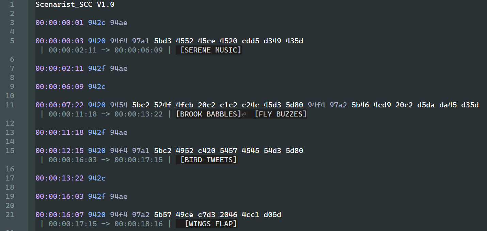
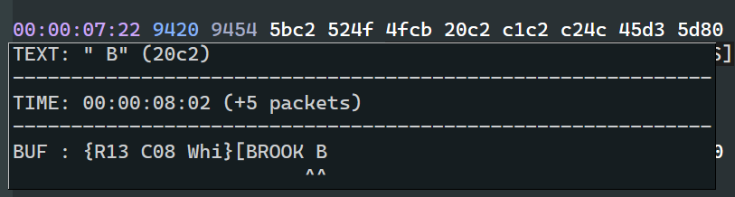

# SCC Inspector

A Notepad++ plugin for analyzing and debugging SCC (Scenarist Closed Caption) files.

## Features

- **Real-time Tooltips**: Hover over SCC codes to see decoded commands, timestamps, and buffer state
- **Error Detection**: Visual indicators for parity errors, invalid timestamps, CC buffer overflow, and malformed codes
- **Buffer Visualization**: See the current caption buffer state at any point in the file
- **Inline Annotations**: Decoded caption text displayed below each line with start/end display times
- **Timecode Calculations**: Automatic frame rate detection with accurate timing
- **Syntax Highlighting**: Color-coded indicators for paired codes and errors

## Screenshots


*Real-time syntax highlighting and inline caption annotations*


*Hover tooltips show decoded commands, timestamps, and buffer state*

## Limitations

- **Pop-on captions only**: Currently tested and optimized for pop-on style captions
- **Roll-up captions**: Not tested or implemented
- **Frame rates**: Supports 23.98, 25, 29.97 NDF, and 29.97 DF. Other frame rates not yet implemented

## Prerequisites

- Notepad++ (version 7.6 or later, tested with 8.9.1)
- Python Script plugin for Notepad++ (from Notepad++ Plugins Admin)
- Python 2.7 (bundled with Python Script plugin)

## Project Structure

```
scc_inspector/
├── scc_inspector.py          # Main plugin script (Notepad++ entry point)
├── src/                       # Library modules
│   ├── __init__.py
│   ├── scc_decoder.py         # SCC code parsing, decoding, and buffer helpers
│   ├── scc_buffer_format.py   # Fast annotation rendering
│   ├── scc_timecode.py        # Timecode calculations
│   └── scc_tooltip.py         # Tooltip formatting
├── tests/                     # Test suite
│   ├── __init__.py
│   ├── run_tests.py           # Primary test runner
│   ├── test_all.py            # Main test suite
│   ├── test_buffer.py         # Buffer creation tests
│   ├── test_control_commands.py  # Control command tests
│   ├── test_overflow.py       # CC buffer overflow tests
│   └── debug_buffer.py        # Interactive debugging tool
├── SCC.xml                    # Notepad++ User Defined Language (UDL)
└── reference/                 # Reference documentation
    └── ...
```

## Installation

1. Install the Python Script plugin in Notepad++ (Plugins > Plugins Admin > Python Script)
2. Clone or download this repository
3. Copy `scc_inspector.py` and the `src/` directory to your Notepad++ Python Scripts folder:
   - Usually located at: `%APPDATA%\Notepad++\plugins\config\PythonScript\scripts\`
4. Restart Notepad++
5. Run the plugin: Plugins > Python Script > Scripts > scc_inspector

### Optional: Auto-load for .scc files

To automatically activate the plugin when opening .scc files:

1. In Notepad++, go to Plugins > Python Script > Configuration
2. Enable "ATSTARTUP" initialization
3. Edit `startup.py` in your Python Scripts folder and add:

```python
# Auto-load SCC Inspector for .scc files
import os
import sys
sys.path.insert(0, os.path.expanduser(r'~\AppData\Roaming\Notepad++\plugins\config\PythonScript\scripts'))
try:
    import scc_inspector
except Exception as e:
    console.show()
    console.writeError("Error loading scc_inspector: " + str(e) + "\n")
```

## Usage

1. Open an SCC file in Notepad++ (try the included `samples/big-buck-bunny.scc`)
2. Run the plugin
3. Hover over any SCC code to see:
   - Decoded command or text
   - Timestamp with packet offset
   - Current buffer state with your code highlighted
4. Visual indicators show:
   - Red squiggle: Invalid codes, timestamps, or CC buffer overflow
   - Red box: Parity errors
   - Green box: Paired codes
5. Decoded captions appear as annotations below each line with display timing (start -> end)

## Syntax Highlighting (Optional)

### User Defined Language (UDL)

The included `SCC.xml` registers "SCC" as a named language in Notepad++, which is required for EnhanceAnyLexer to apply regex-based coloring to `.scc` files.

1. In Notepad++, go to Language > User Defined Language > Define your language...
2. Click **Import** and select `SCC.xml` from this repo
3. Restart Notepad++
4. Open an `.scc` file and select Language > SCC from the menu

### EnhanceAnyLexer (regex-based colors)

For color-coded highlighting of timestamps, control codes, and captions, install the [EnhanceAnyLexer plugin](https://github.com/Ekopalypse/EnhanceAnyLexer) and add this configuration (optimized for dark mode with Obsidian theme):

```ini
[Global]
indicator_id=0
offset=0
regex_error_style_id=30
regex_error_color=0x756ce0
use_rgb_format=0

[scc]
; 1. Timestamps (Pink)
#f7a6cb = ^\d\d:\d\d:\d\d[:;]\d\d

; 2. Null/Filler Codes (Light Green)
#a6d9c8 = \b8080\b

; 3. General Control Codes (Grey)
#c8ada6 = \b[19][0-9a-fA-F]{3}\b

; 4. Caption Start/End (Blue) - Must come after Grey to override
#fab387 = \b(942[0cf]|1c2[0cf]|152[0cf]|9d2[0cf])\b
```

> Note: The UDL must be installed first — EnhanceAnyLexer uses the language name "SCC" to match the config section above.

## Running Tests

```bash
# Run all tests at once
python tests\run_tests.py

# Or run individual test suites
python tests\test_all.py
python tests\test_buffer.py
python tests\test_control_commands.py
python tests\test_overflow.py
```

## Development

The main plugin script (`scc_inspector.py`) imports library modules from the `src/` directory. All supporting code is organized in `src/`, keeping the root clean and following Python best practices.

### Code Formatting

This project uses [Ruff](https://github.com/astral-sh/ruff) for linting and formatting:

```bash
# Format code
ruff format

# Check for issues
ruff check
```

**Note**: This project targets Python 2.7 for Notepad++ compatibility. The `u` prefix on Unicode strings and `# fmt: skip` comments are intentional to preserve special characters.

## Contributing

Contributions are welcome! Please see [CONTRIBUTING.md](CONTRIBUTING.md) for guidelines.

## License

This project is licensed under the MIT License - see the [LICENSE](LICENSE) file for details.

## Acknowledgments

- [libcaption](https://github.com/szatmary/libcaption) - Reference implementation for EIA-608 decoding
- [McPoodle's SCC Tools](http://www.theneitherworld.com/mcpoodle/SCC_TOOLS/DOCS/SCC_TOOLS.HTML) - Comprehensive SCC format documentation
- Built for the Notepad++ Python Script plugin

## Support

If you encounter issues or have questions:
- Check existing [Issues](https://github.com/dkneeland/scc_inspector/issues)
- Open a new issue with details about your problem
- Include sample SCC files when possible (without sensitive content)
